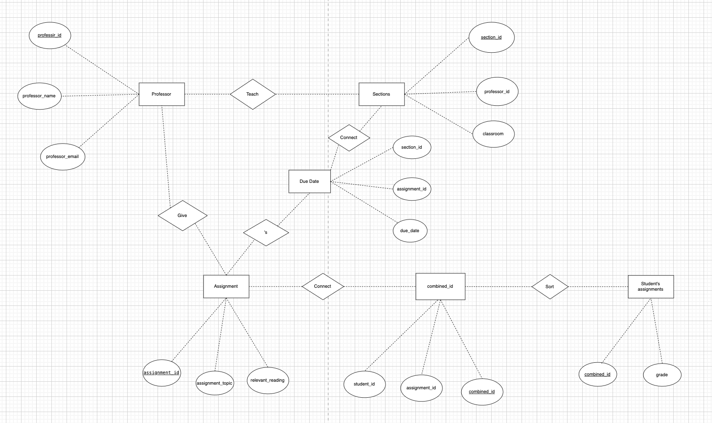

# Data Normalization and Entity-Relationship Diagramming

## Original table in First Normal Form
| assignment_id | student_id | due_date  | professor | assignment_topic          | classroom  | grade | relevant_reading      | professor_email          |
|---------------|------------|-----------|-----------|---------------------------|------------|-------|------------------------|--------------------------|
| 1             | 1          | 23.02.21  | Melvin    | Data normalization        | WWH 101    | 80    | Deumlich Chapter 3     | l.melvin@foo.edu         |
| 2             | 7          | 18.11.21  | Logston   | Single table queries      | 60FA 314   | 25    | Dümmlers Chapter 11    | e.logston@foo.edu        |
| 1             | 4          | 23.02.21  | Melvin    | Data normalization        | WWH 101    | 75    | Deumlich Chapter 3     | l.melvin@foo.edu         |
| 5             | 2          | 05.05.21  | Logston   | Python and pandas         | 60FA 314   | 92    | Dümmlers Chapter 14    | e.logston@foo.edu        |
| 4             | 2          | 04.07.21  | Nevarez   | Spreadsheet aggregate functions | WWH 201    | 65    | Zehnder Page 87        | i.nevarez@foo.edu        |

## Features which should not be in Fourth Normal Form
1. The student with student_id 2 have two different assignment with assignment_id 4 and 5 in one table. The table contains two independent multi-valued fact about one student, which violates 4NF.
2. In assumption, we know that a professor might (or might not) give the same assignment to different sections of the same course, but with different due dates. And different sections of the same course may meet in different classrooms, even if the professor is the same. It means the classrooms and due_date depend on sections. The columns "professor", "classroom", "professor_email" , and "due_date". are irrelevant to the "assignment_id", which violate 3NF. Since 4NF must be based on a 3NF table, it also violates 4NF.
3. From the table, "professor", "assignment_topic", "classroom", "relevant_reading", and "professor_email" might repeat for different students, which is a data redundancy. It violates the 2NF. Since 4NF must be based on a 2NF table, it also violates 4NF.

## The 4NF-compliant version of the dataset
### Professors Table
"professor_id" is the primary key.
| professor_id | professor_name | professor_email       |
|--------------|----------------|-----------------------|
| 1            | Melvin         | l.melvin@foo.edu      |
| 2            | Logston        | e.logston@foo.edu     |
| 3            | Nevarez        | i.nevarez@foo.edu     |

### Sections Table
"section_id" is the primary key.
| section_id | professor_id | classroom |  
|------------|--------------|-----------|
| 1          | 1            | WWH 101   | 
| 2          | 2            | 60FA 314  | 
| 3          | 3            | WWH 201   | 

### Students' Assignments Table
"student_id" is the primary key.
| combined_id | grade | 
|---------------|-------| 
| 1             | 80    | 
| 2             | 25    |
| 3             | 75    |
| 4             | 65    |

### Combined id Table
"combined_id" is the primary key.
| combined_id | student_id | assignment_id |
|-------------|------------|---------------|
| 1           | 1          | 1             |
| 2           | 7          | 2             |
| 3           | 3          | 1             |
| 4           | 1          | 5             |
| 5           | 2          | 4             |

### Due Date Table
"section_id" is the primary key.
| section_id | assignment_id | due_date  |
|------------|---------------|-----------|
| 1          | 1             | 23.02.21  |
| 2          | 2             | 18.11.21  |
| 3          | 4             | 04.07.21  |
| 4          | 5             | 05.05.21  |

### Assignments Table
"assignment_id" is the primary key.
| assignment_id | assignment_topic       | relevant_reading       |
|---------------|------------------------|------------------------|
| 1             | Data normalization     | Deumlich Chapter 3     |
| 2             | Single table queries   | Dümmlers Chapter 11    |
| 4             | Spreadsheet functions  | Zehnder Page 87        |
| 5             | Python and pandas      | Dümmlers Chapter 14    |

## Entity-Relationship Diagram

## Changes
1. I seperate columns related to "professor_id", "assignment_id", "due_date " and "grade" into different tables.
2. Since some information such as "due_date" depends on sections, I make up a table stored information relevant to sections.
3. Since "grade" depends on both "assignment_id" and "student_id", in order to have a primary key in the table about "grade", I combine them to get a unique key called "combined_id".